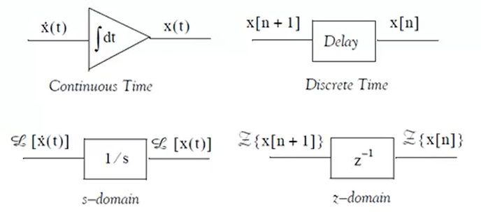

[TOC]


# Matlab学习

# 1. 基础语法与数据处理功能

> 掌握数据的导入、处理和可视化等操作

## 1.1 基本语法

- 执行不显示结果：“；”的作用

- 注释： "%",快捷键Ctrl+R，取消注释快捷键：快捷键Ctrl+T

- clear:清除工作区所有变量（内存中删除所有）

- clc:清楚命令行窗口所有文本

- 输入输出：输出函数disp(), 输入函数input("提示语句")

- save：保存工作空间所有变量

- 变量命名：变量名称由字母组成，后跟任意数量的字母，数字或下划线。(大小写区分)

  变量名称可以是任意长度，但是，MATLAB仅使用前N个字符，其中N由函数给定 **namelengthmax**。

- **who**命令显示您已使用的所有变量名。**whos**命令显示了有关变量的更多信息

- "..."：可以使用省略号(...)将长作业扩展到另一行。

- format命令：默认MATLAB显示带有四个小数位值(short format),**format short e**命令允许以指数形式显示,**format long**命令在小数点后显示16位数字

## 1.2 变量

在MATLAB环境中，每个变量都是一个数组或矩阵

### 特殊变量和常量

| **ans** | 最近计算的答案。               |
| ------- | ------------------------------ |
| **eps** | 浮点精度。                     |
| **i,j** | 虚数单位√-1。                  |
| **Inf** | 无穷。                         |
| **NaN** | 未定义的数值结果（不是数字）。 |
| **pi**  | π                              |

### 字符与字符串

 ```matlab
 s = 'a'
 abs(s)   %转化为数字
 char(97) %转化为字符串
 num2str(65) %数字转换为字符串
 ```

### 向量

向量是一维数字数组。MATLAB允许创建两种类型的向量-

- 行向量

  行向量通过将元素集括在方括号中并使用空格或逗号定界元素来创建。

- 列向量

​		列向量通过将元素集括在方括号中并使用分号分隔元素来创建。

### 矩阵

matlab中矩阵的表示方法：**“行”**中数据用**空格**或者**逗号**隔开，列用“;”隔开，整体用“[ ]”括起来

```matlab
A=[1 2 3;4 5 6;7 8 9]

A =

     1     2     3
     4     5     6
     7     8     9

```

提取矩阵中指定位置元素

1. 指定行和列:**A(m,n)**,提取第m行，第n列
2. 某一行全部元素：**A(m,:)**
3. 某一列全部元素：**A(:,n)**
4.  取出某些行：**A([m,n],: )**（第m行和第n行组成一个矩阵）
5. 取出某行到某行：**A(m:n,:), A(m:end,:)(end是倒数第一行)**
6. 跳跃式提取：**A(m:k:n,:)第m行到第n行每隔取一次**
7. 得到全部元素：**A(: )输出结果是一个列向量**

**strcat()函数**：粘贴字符串，可以把两个字符串粘贴在一起

**sum()函数**：这是加法函数，可以分别对矩阵进行加法计算的。
假设A是一个矩阵，对列求和：sum(A)或者sum(A,1);对行求和：sum(A,2)。这里的“1”和“2”是**dim值，表示维度，1是对列，2是对行，通常1可以省略**。整个矩阵求和：sum(A(: )）

## 1.3 数据导入

### 1.3.1 importdata

| 1    | **A = importdata(filename)**从*filename*表示的*文件*中将数据加载到数组A中。 |
| ---- | ------------------------------------------------------------ |
| 2    | **A = importdata('-pastespecial')**从系统剪贴板而不是文件加载数据。 |
| 3    | **A = importdata(___, delimiterIn)**将 delimiterIn 解释为 ASCII 文件、文件名或剪贴板数据中的列分隔符。可以对上述语法中的任何输入参数使用 delimiterIn。 |
| 4    | **A = importdata(___, delimiterIn, headerlinesIn)**从ASCII文件，文件名或剪贴板中加载数据，并从行*headerlinesIn + 1*开始读取数字数据。 |
| 5    | **[A, delimiterOut, headerlinesOut] = importdata(___)**使用前面语法中的任何输入参数，返回delimiterOut中输入ASCII文件的检测到的分隔符字符和headerlinesOut中检测到的头行数。 |

```
filename = 'ddd.txt';
delimiterIn = ';';
headerlinesIn = 1;
A = importdata(filename, delimiterIn, headerlinesIn); //headerlinesIn表示有几行列头，delimiterIn表示列之间的分隔符
```

### 1.3.2 文件IO

底层的文件I/O函数可以对文件数据进行更大程度的控制，但是需要更详细的文件信息

```matlab
%%
myfile.txt
Rainfall Data
Months: June, July, August
 
M = 3
12:00:00
June-2012
17.21  28.52  39.78  16.55 23.67
19.15  0.35   17.57  NaN   12.01
17.92  28.49  17.40  17.06 11.09
9.59   9.33   NaN    0.31  0.23 
10.46  13.17  NaN    14.89 19.33
20.97  19.50  17.65  14.45 14.00
18.23  10.34  17.95  16.46 19.34
09:10:02
July-2012
12.76  16.94  14.38  11.86 16.89
20.46  23.17  NaN    24.89 19.33
30.97  49.50  47.65  24.45 34.00
18.23  30.34  27.95  16.46 19.34
30.46  33.17  NaN    34.89  29.33
30.97  49.50  47.65  24.45 34.00
28.67  30.34  27.95  36.46 29.34
15:03:40
August-2012
17.09  16.55  19.59  17.25 19.22
17.54  11.45  13.48  22.55 24.01
NaN    21.19  25.85  25.05 27.21
26.79  24.98  12.23  16.99 18.67
17.54  11.45  13.48  22.55 24.01
NaN    21.19  25.85  25.05 27.21
26.79  24.98  12.23  16.99 18.67

%%
filename = 'myfile.txt';
rows = 7; 
cols = 5;
 
%打开文件
fid = fopen(filename);
 
%读取文件头，找到M（月数）
M = fscanf(fid, '%*s %*s\n%*s %*s %*s %*s\nM =%d\n\n', 1);
 
%读取每一组测量数据
for n = 1:M
   mydata(n).time = fscanf(fid, '%s', 1);
   mydata(n).month = fscanf(fid, '%s', 1);
 
   %fscanf按列顺序填充数组，
   %把结果转置
   mydata(n).raindata  = ...
      fscanf(fid, '%f', [rows, cols]);
end
for n = 1:M
   disp(mydata(n).time), disp(mydata(n).month)
   disp(mydata(n).raindata)
end
 
%关闭文件
fclose(fid);
```

### 1.3.3 导入excel表格数据

在主页选项卡->导入数据->选择excel文件。

导入范围：

导入的范围默认是第二行开始

可以按CTRL键，选中想导入的部分数据

变量名称行，只能识别英文，

导入类型：

输出类型决定了导入数据的存储方式，一般选择为表或列向量，还有数值矩阵、字符串数组等选项。


## 1.4 数据的预处理

smooth:平滑函数

```matlab
smooth
```

### 处理缺失值和异常值

缺失：有图形化工具可以使用

- 插值

  - 均值、众数插补

    适合用于统计数据，对个体精度要求不大。

  - Newton插值法

    适合关注函数精度不关心变化的数据

  - 样条插值

    适合对精度要求高、无突变的数据

- 删除

  某项缺失太多则删除该项指标

异常的确定： 处理与缺失值类似

- 正态分布原则

  在基于平均值的规定波动范围之后为异常值

  （μ-3a，μ+3a）

- 画箱型图

  合理区间外的为异常值

  [Q~1~ - 1.5\*IQR，Q~3~ + 1.5\*IQR],IQR = Q~3~ - Q~1~

## 1.5 绘图(可视化)

### plot

要绘制函数的图形，需要执行以下步骤：

- 通过指定变量 x 的值范围来定义 x，为此函数将绘制出来
- 定义函数， **y = f(x)**
- 调用 **plot** 命令，如下 **plot(x, y)**

```matlab
%%
x = [-100:5:100];
y = x.^2;
plot(x, y)
```

### 一个图上绘制多个函数

- 一个plot命令可以绘制多个函数 
- 可以通过plot第三个参数调整颜色和线条样式
- legend命令标明每条线对应的函数

```matlab
x = [-10 : 0.01: 10];
y = 3*x.^4 + 2 * x.^3 + 7 * x.^2 + 2 * x + 9;
g = 5 * x.^3 + 9 * x + 2;
plot(x, y, 'r.-', x, g, 'g-')   %可以通过第三个参数调整颜色和线条样式 
legend('Sin(x)', 'Cos(x)')     %标明每条线对应的函数
%% 

```

### 在图形上添加标题，标签，网格线和缩放

添加标题、沿 x 轴和 y 轴的标签、网格线，并且还可以调整轴以使图形更漂亮。

- **xlabel** 和 **ylabel** 命令产生沿x轴和y轴的标签。
- **title** 命令在图形上放置标题。
- **grid on** 命令将网格线放在图形上。
- **axis equal** 命令使用相同的比例因子和两个轴上的间距生成图。
- **axis square** 命令生成一个正方形图。

``` matlab
x = [0:0.01:10];
y = sin(x);
plot(x, y), xlabel('x'), ylabel('Sin(x)'), title('Sin(x) Graph'),
grid on, axis equal
```

设置轴比例：**axis**命令允许您设置轴刻度。您可以按以下方式使用axis命令提供x和y轴的最小值和最大值：

```
%%     
%axis ( [xmin xmax ymin ymax] )
x = [0 : 0.01: 10];
y = exp(-x).* sin(2*x + 3);
plot(x, y), axis([0 10 -1 1])

```

生成子图：在同一图形中创建一个绘图数组时，每个绘图都称为子绘图。**subplot** 命令用于创建子图。

该命令的语法是-

```
subplot(m, n, p)
```

其中，*m*和*n*是绘图数组的行数和列数，而*p*指定放置特定绘图的位置。

使用subplot命令创建的每个图都可以具有自己的特征(格子，线条样式等)。

```c
x = [0:0.01:5];
y = exp(-1.5*x).*sin(10*x);
subplot(1,2,1)
plot(x,y), xlabel('x'),ylabel('exp(–1.5x)*sin(10x)'),axis([0 5 -1 1])
y = exp(-2*x).*sin(10*x);
subplot(1,2,2)
plot(x,y),xlabel('x'),ylabel('exp(–2x)*sin(10x)'),axis([0 5 -1 1])
```

### 条形图

- bar命令
- print命令将字符串按指定格式写入句柄所指定的文件中

```matlab
x = [1:10]；
y = [75, 58, 90, 87, 50, 85, 92, 75, 60, 95];
bar(x,y), xlabel('Student'),ylabel('Score'),
title('First Sem:')
print -deps graph.eps %使用print函数将图表保存为EPS格式的图像文件，文件名为"graph.eps"。
```

### 等高线

- contour命令绘制等高线
- meshgrid命令用于生成在二维网格矩阵，以便在三维图形绘制和插值等应用中使用。

```
[x,y] = meshgrid(-5:0.1:5,-3:0.1:3);   %自变量
g = x.^2 + y.^2;                       %我们的函数
contour(x,y,g)                         %调用等高线函数
print -deps graph.eps
```

### 三维图

- 使用**meshgrid**命令在函数的范围内创建一组(x,y)点
- 我们分配函数本身
- 使用**surf**命令创建三维图

```
[x,y] = meshgrid(-2:.2:2);
g = x .* exp(-x.^2 - y.^2);
surf(x, y, g)
```

## 1.6 脚本与函数

### 1.6.1 创建并运行脚本文件

要创建脚本文件，您需要使用文本编辑器。您可以通过两种方式打开MATLAB编辑器-

- 使用命令提示符
- 使用IDE

```
edit 
Or
edit <filename>
```

创建并保存文件后，可以通过两种方式运行它

- 单击**Run**编辑器窗口上的按钮或快捷键F5
- 只需在命令提示符下键入文件名（不带扩展名）

### 1.6.2 函数

函数是在单独的m文件中定义的。文件名和函数名应该相同。

函数在其自己的工作空间（也称为本地工作空间）中对变量进行操作，与在MATLAB命令提示符下访问的工作空间（称为基本工作空间）不同。

函数可以接受多个输入参数，并且可以返回多个输出参数。

函数语句的语法是

```matlab
function [out1,out2, ..., outN] = myfun(in1,in2,in3, ..., inN)
```

### 1.6.3 匿名函数

匿名函数就像传统编程语言中的内联函数一样，是在单个MATLAB语句中定义的。它由一个MATLAB表达式以及任意数量的输入和输出参数组成。

您可以直接在MATLAB命令行或在函数或脚本中定义匿名函数。

这样，您可以创建简单的功能，而不必为其创建文件。

```matlab
f = @(arglist) expression  %从表达式创建匿名函数的语法是
y = f(arglist)    %调用匿名函数

```

### 1.6.4 主函数和子函数

 必须在文件中定义除匿名函数以外的任何函数。每个函数文件都包含一个首先出现的必需主函数，以及在主函数之后并由其使用的任意数量的可选子函数。

可以从定义主文件的文件外部（从命令行或其他函数）调用主函数，但是不能从命令行或其他函数在功能文件外部调用子函数。

子函数仅对主函数和定义它们的函数文件中的其他子函数可见。

# 2. 统计工具和特征提取方法

> 解如何从电池数据中提取有用的特征。

## 2.1 统计工具

统计：

- 数据的科学

- 包括资料的收集、分析、解释、呈现和处理
- 分为叙述统计学和解释统计学   

### 排序

sort：按列排序

sortrows：按行排序

### 叙述统计

- 概括量

  - 中心趋势

    - mean：值之和的平均
    - median：数值中位数
    - mode：点数出现次数最多

  - 离散趋势

    - range(最大值最小值间的距离)：极差，min/max
    - std：标准差
    - var：方差

  - 计算百分位数

    - prctile(X,p)，计算X中大于p%的值，p必须介于0和100之间。

      boxplot命令，作盒图，表示分位数

    


# 3. 建模工具和方法

> 学习如何建立适合于SOC估计的模型。

simlink

建模与仿真步骤：

- 建立数学模型

- 将数学模型转化为框图（相加点右侧的变量为微分方程最高阶导数）
- 将框图在sim中实现
- 设置模块对应参数
- 设置仿真运行参数
- 运行并分析仿真结果

## 常用模块库

### 输入输出子系统

将相对独立的模块，封装成库

选中一部分模块后，通过右键或者建模功能栏里面的插入子系统封装成子系统

### Ground模块和Terminator

分别将输入和输出模块中未连接信号进行封闭处理，防止报错

### 常量及加减乘除模块

常量模块： 分为一维(数组，列向量分布)和矩阵(横向)两种值

加减乘除模块可以设置为点运算和矩阵运算

### 总线和示波器模块

将信号线聚成一路，便于观看，该模块以及不常用

### 复用器和分路器模块

复用是发送多路信息信号流的一种方法，以单个的复合的信号在载波上传输，在接收端恢复成多路信号

分配规则：自行设置；自动分配

### 开关模块和增益模块

开关模块：根据条件判断进行

增益模块：可以用于标量、向量(数组，一一相乘)、矩阵(线性代数)格式的数据

可以在模块中选择顺序和运算规则

可以在工作区里面定义变量给其赋值，在simulink中直接填入变量名使用

### 积分模块

可以指定初始条件(内部，外部)，指定输出饱和上下限

去`simulation`工具栏中设置数值积分的解法

复位模块，复位模块的输入达到设置的复位条件，积分模块的输出恢复到初始值

状态输出端口

### 单位延迟模块

延迟模块是构成离散系统的基础

 

构建构建相应的数字滤波器，离散时间传递函数

### 离散时间积分模块

微分方程数值积分的解法

前向欧拉法：

在任一步长内，用一段直线代替函数y（t）的曲线，此直线段的斜率等于该函数在该步长**起点**的斜率。

后向欧拉法：

在任一步长内，用一段直线代替函数y（t）的曲线，此直线段的斜率等于该函数在该步长**终点**的斜率。

## 连续模块库

微分模块，需要注意输入信号的性质

### 状态空间模块

 

# 4. 算法开发和优化技术

> 了解如何设计和实现SOC估计算法。

# 5. 学习Matlab中的模型验证和评估方法

> 掌握如何对SOC估计模型进行准确性和稳定性的评估