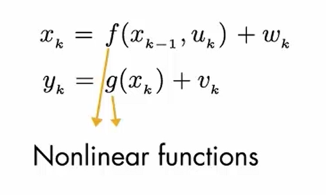

[TOC]

# 现代控制理论

## 控制动态系统的步骤

简单地说，控制一个动态系统有下列四个基本步骤：

- 建模基于物理规律建立数学模型；
- 系统辨识基于输入输出实测数据建立数学模型；
- 信号处理用滤波、预报、状态估计等方法处理输出；
- 综合控制输入用各种控制规律综合输入。

## 控制系统的状态空间表达式

**状态变量**：一组能以最小个数完全表征系统运动状态的变量，每个状态变量描述了系统的一个自由度，代表了系统的一个独立特性。

- 性质：知道x初始值和t~0~之后任意时刻的输入，即可以确定任何时刻的x~t~

**状态矢量**：如果 n 个状态变量用 x~1~(t),x~2~(t),…, x~n~(t)表示，并把这些状态变量看作是矢量x(t)的分量，则 x(t)就称为状态矢量。

**状态空间**：以状态变量x~1~(t),x~2~(t),…, x~n~(t) 为坐标轴所构成的n维空间，称为状态空间。在特定时刻 ，状态矢量x(t)在状态空间中是一点。 

**状态方程**：由系统的状态变量构成的一阶微分方程组称为系统的状态方程。  

输出方程：在指定系统输出的情况下，该输出与状态变量间的函数关系式。

状态空间表达式：状态方程和输出方程总合起来，构成对一个系统完整的动态描述称为系统的状态空间表达式  

# 卡尔曼滤波

## 使用场景

无法直接观测变量，通过可观测的间接测量值，估算变量最优结果

作用

在存在一定噪声的情况下，预测需要的参数

设计最优状态观测器

## 状态观测器

**引入状态观测器是为了解决状态反馈时一些状态变量不能观测的问题。**

状态观测器实质上就是在原系统外，另外人为构造了一个系统，他能够输出和原系统的状态变量近似一样的输出变量，既然一样，就可以作为原系统的状态变量进行状态反馈。让原系统的输入输出作为观测系统的输入，输出我们已经知道是原系统状态变量的观测值（近似值）。

模型以及控制器(反馈调节部分)

***e^.^为e的导数，代入e~obs~ =e^t得出解***，拉普拉斯变换

A值可能和真实值也有误差，通过控制器k，控制衰减速率，确保更快的消除错误，保证x收敛到真实值越快

## 最优状态估计

y~k~：系统输出的值

x~k~：想观测的值

u~k~：系统的输入，速度

v~k~：测量噪声，影响测量结果

w~k~：过程噪声，影响输入的变化

A：状态转移矩阵，上一个状态和下一个状态的关系

B：控制矩阵

将预测值和测量值的概率函数相乘，计算所得函数的均值来实现最佳估计

## 最优状态估计计算方法和过程

卡尔曼滤波器就是一种为随机系统设计的状态观测器，

使用前一个时间步的估算状态以及当前的输入，预测当前状态 χ，χ~k~^-^为预估值，χ~k~为后验估值

- 预测

χ~k~^-^：预估值

A：表示状态转移矩阵（系统动态模型）

B：控制矩阵

P~k~^-^：第k时刻预估状态协方差矩阵，预测状态中，不确定性的度量，不确定性来自过程噪声和预估值的不确定性的影响

Q：过程噪声协方差矩阵（描述状态转移过程中的噪声）

- 更新

R：观测噪声协方差矩阵（描述观测过程中的噪声）

P~k~：第k时刻状态协方差矩阵/误差协方差   （描述状态转移过程中的噪声）

C：观测矩阵（描述观测向量与状态向量之间的线性关系）

K~k~：表示第k时刻的卡尔曼增益

x~k~：表示第k时刻的状态向量（系统状态）

χ~k~^-^：表示第k-1时刻的状态向量

y~k~：表示第k时刻的观测向量

I：单位矩阵

根据预测步骤得出的值，更新估计状态值及误差协方差，调整卡尔曼增益K，使得更新后的状态值误差协方差最小

系统模型用于计算状态预估值和误差协方差p

## 非线性状态观测器

EKF
需要非线性模型能较好进行线性化

UKFS

PF粒子滤波器

适用于任意分布

